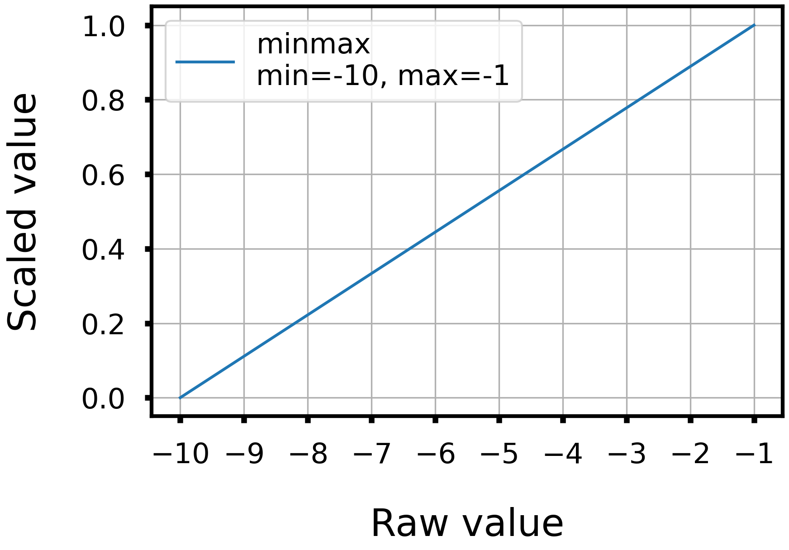
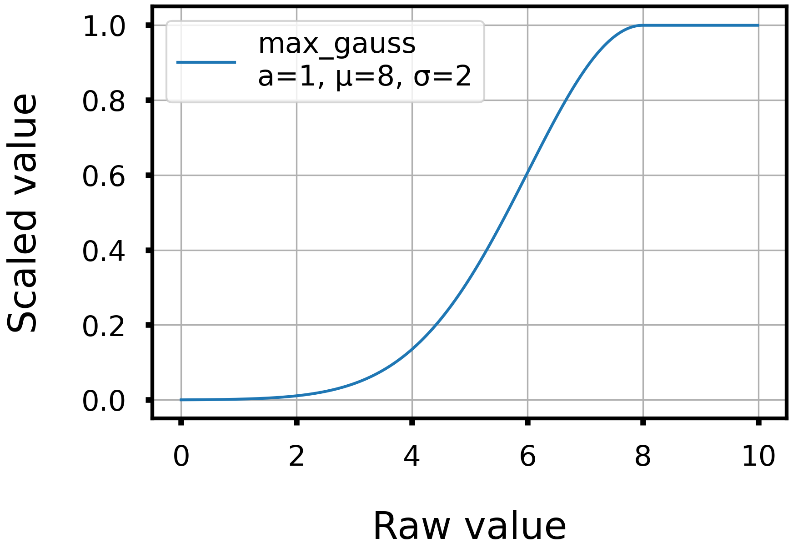
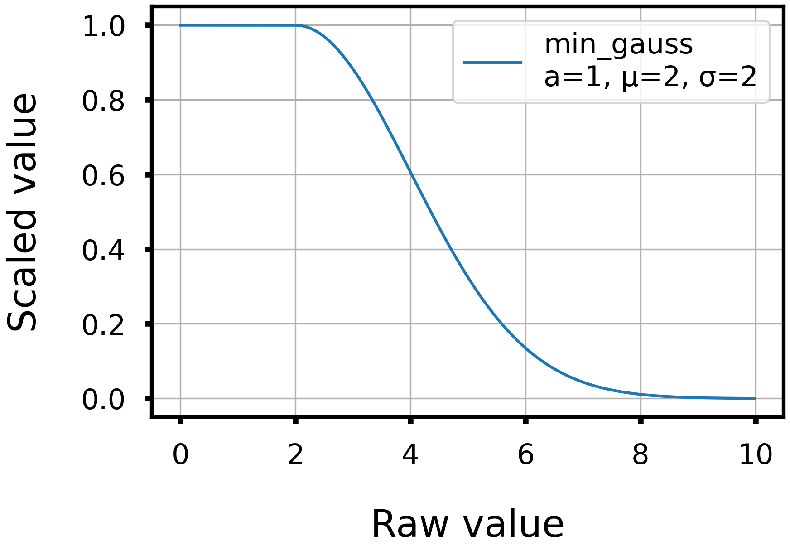

# README for scaling functions in `scaler.py`

## `minmax`

- The `minmax` function scales the value so that the minimum value defined by the argument is zero and the maximum value is one.

- If the minimum value is set to -10 and the maximum value to -1, the scaling will be as shown in the figure below.

  

## `max_gauss`

- The `max_gauss` function corresponds to the left half of a Gaussian function. Values larger than μ are given full score, and values smaller than μ decrease continuously to zero[1].

- If `a=1, μ=8, σ=2`, the scaling will be as shown in the figure below.

  

## `min_gauss`

- The `min_gauss` function corresponds to the right half of a Gaussian function. Values smaller than μ are given full score, and values larger than μ decrease continuously to zero[1].

- If `a=1, μ=8, σ=2`, the scaling will be as shown in the figure below.

  

### Reference
[1] N. Brown , M. Fiscato , M. H. Segler and A. C. Vaucher , *J. Chem. Inf. Model.*, 2019, 48 , 1096 —1108 . https://doi.org/10.1021/acs.jcim.8b00839
